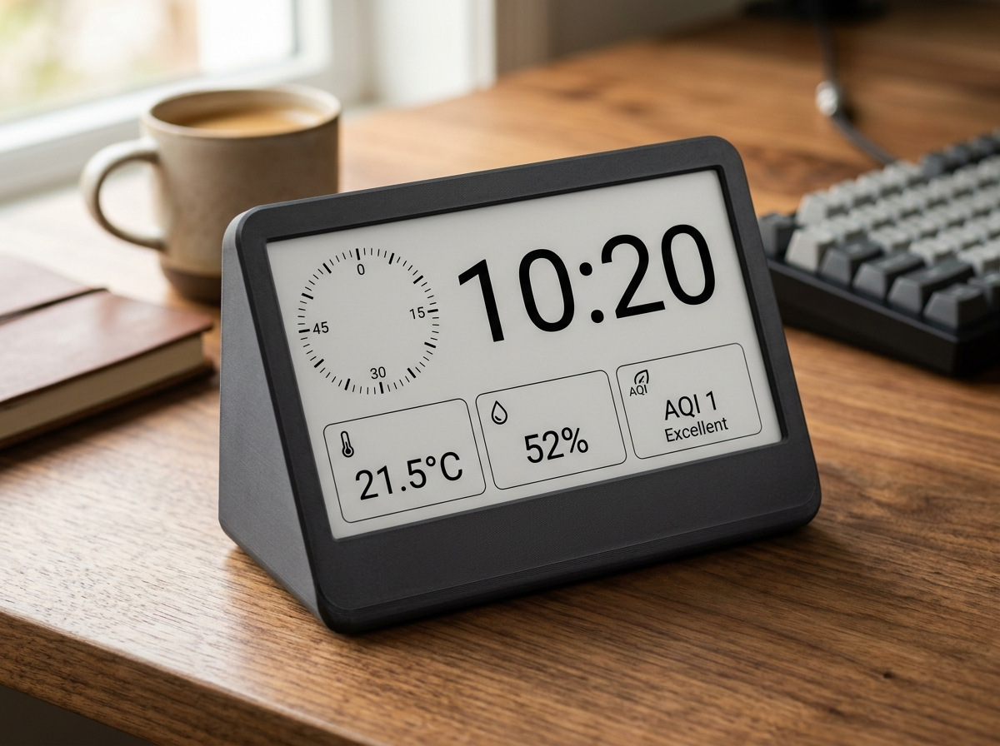

# ESP32-E E-Paper Smart Clock & Environmental Monitor

<p align="center">
  
</p>

An ultra-low-power, battery-friendly smart desk clock and environmental monitor built with the **DFRobot FireBeetle 2 ESP32-E**, a **Waveshare 7.5" V2 (800x480) E-Paper display**, and an **ENS160 + AHT21 sensor module**.

Features automated **dual-mode Over-The-Air (OTA) updates** (GitHub Releases & local Web Browser), a fast 10-second circular seconds ring with differential refresh, and a custom **3D-printable 70° desk stand enclosure**.

---

## ✨ Features

- **High-Contrast 7.5" E-Paper Display (800x480)**:
  - Giant, crisp time typography and full date display.
  - Animated circular 60-second progress ring with 10-second tick updates.
  - Periodic anti-ghosting full refresh with differential partial updates for minimal power consumption.
- **Precision Environmental Telemetry**:
  - **AHT21**: Ambient temperature (°C / °F) and relative humidity with comfort indicators.
  - **ENS160**: Multi-gas indoor air quality (AQI rating 1–5, TVOC in ppb, equivalent CO₂ in ppm).
- **Dual-Mode OTA Firmware Updates**:
  - **Automated GitHub Releases**: Checks for newer releases via GitHub Releases during periodic 6-hour NTP syncs and flashes in the background.
  - **Local Web Browser Updates**: Interactive web dashboard at `http://<IP>/update` or `http://eink-clock.local/update` with live progress bars.
  - **PlatformIO / ArduinoOTA**: Direct wireless network flashing over port 3232.
- **Power Optimization**:
  - Utilizes ESP32 deep sleep between updates (radio shut down, I2C powered off).
  - Displays battery voltage, percentage, and charging state via ADC characterization.
- **Custom 3D-Printable 70° Desk Stand**:
  - Toolless 6-point snap-fit assembly.
  - Thermally isolated sensor chamber with dedicated ventilation louvers.
  - Direct access port for USB-C charging and programming.

---

## 🛠️ Hardware Stack

| Component | Model / Spec | Interface |
| :--- | :--- | :--- |
| **Microcontroller** | DFRobot FireBeetle 2 ESP32-E (16MB Flash) | — |
| **Display Panel** | Waveshare 7.5" Black/White V2 (800x480) | Hardware SPI (VSPI) |
| **Display Driver** | Waveshare e-Paper Driver HAT (Rev 2.3) | GPIO 13 (PWR latch), CS=14, DC=26, RST=25 |
| **Sensors** | ENS160 + AHT21 Combo Breakout Module | I2C (SDA=21, SCL=22) |
| **Power** | 3.7V LiPo Pouch Cell (1000–2500 mAh) | PH2.0 battery connector |

---

## 🚀 Getting Started

### 1. Build and Flash via PlatformIO
Connect the FireBeetle 2 ESP32-E via USB:
```bash
# Build firmware
pio run

# Upload firmware and monitor serial output
pio run -t upload -t monitor
```

### 2. Creating Releases (Auto-OTA)
To publish a new firmware version to GitHub Releases:
```bash
./create-release.sh
```
The script will auto-increment the patch version, compile the binary, commit, tag, and publish the release via GitHub CLI (`gh`). Any connected clocks will automatically detect and install the update on their next scheduled sync!

### 3. 3D Printable Enclosure
Check out the [`cad/`](cad/) directory for:
- `front_bezel.stl`: Front frame with display viewport and snap slots.
- `rear_stand.stl`: 70° angled desk stand housing.
- `eink_clock_enclosure.scad`: Fully parametric OpenSCAD source file.
- `README.md`: Slicer settings and step-by-step assembly guide.
